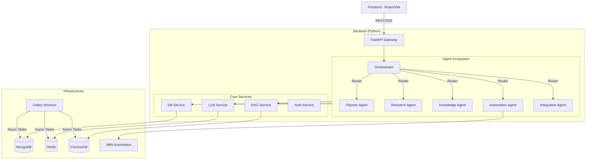

# LearnLab System Architecture

This document provides a comprehensive overview of the LearnLab system architecture, designed to help developers, architects, and stakeholders understand the system's design, components, and data flows.

## 1. System Overview

**LearnLab** is an agentic AI platform designed to create a personalized, automated learning environment. It uses a multi-agent architecture orchestrated by a central brain to handle diverse tasks ranging from curriculum planning to research summarization and interactive tutoring.

### Key Capabilities
*   **Personalized Learning**: Generates custom curriculum based on goals and skill levels.
*   **Deep Research**: Autonomously searches and synthesizes information from the web and academic sources.
*   **Interactive Tutoring**: Provides a chat interface for Q&A and code walkthroughs.
*   **Automation**: Integrates with external tools (via N8N) to automate workflows like social posting.
*   **Progress Tracking**: Monitors learning progress, streaks, and quiz performance.

---

## 2. High-Level Architecture

The system follows a **Micro-Agent Architecture** where a central Orchestrator routes tasks to specialized agents. It is built as a monolithic FastAPI backend serving a React frontend, supported by scalable infrastructure services.

---

## 3. Core Components

### 3.1 Frontend (`frontend-vite/`)
*   **Technology**: React, Vite, Tailwind CSS, Lucide React.
*   **Role**: Provides the user interface for chat, dashboards, plan creation, and reading.
*   **Key Features**:
    *   Streaming chat responses (Server-Sent Events).
    *   Markdown rendering with code syntax highlighting.
    *   Interactive learning plan timelines.
    *   Responsive dashboard.

### 3.2 Backend (`backend/`)
*   **Technology**: Python 3.10+, FastAPI, Uvicorn.
*   **Role**: REST API gateway, authentication provider, and agent host.
*   **Key Modules**:
    *   `routers/`: API endpoints defined here (e.g., `/chat`, `/plans`, `/research`).
    *   `core/`: Contains the business logic and agent definitions.
    *   `services/`: Wrappers for external services (DB, LLM, N8N).

### 3.3 Orchestration (`backend/core/orchestrator.py`)
*   **Technology**: LangGraph (StateGraph).
*   **Role**: The "Brain" of the operation. It receives a user message, decides which agent is best suited to handle it, and routes the request.
*   **Logic**:
    1.  **Router Node**: Analyzes intent (e.g., "Create a plan" -> Planner, "What is X?" -> Knowledge).
    2.  **Execution**: Invokes the specific agent sub-graph or function.
    3.  **Response**: Streams the result back to the client.

### 3.4 Data Layer
*   **MongoDB**: Primary persistent storage.
    *   `learning_plans`: Stores curriculum structures.
    *   `user_progress`: Tracks completion and stats.
    *   `summaries`: Stores research outputs.
    *   `users`: User profiles and auth data.
*   **Redis**:
    *   **Caching**: Caches expensive LLM responses to reduce cost and latency.
    *   **Message Broker**: Powering Celery for background tasks.
*   **ChromaDB**: Vector store for RAG (Retrieval Augmented Generation). Stores embeddings of documentation and research papers.

### 3.5 Background Workers (`backend/tasks/`)
*   **Technology**: Celery, Redis.
*   **Role**: Handles long-running or scheduled tasks.
    *   Sending scheduled reminders (Email/Push).
    *   Calculating daily streaks.
    *   Running periodic research jobs.

---

## 4. Agent Ecosystem

Each agent is a specialized module responsible for a specific domain.

| Agent | File | Responsibility | Key Inputs | Key Outputs |
|-------|------|----------------|------------|-------------|
| **Planner** | `planner_agent.py` | Curriculum Design | Goal, Skill Level, Hours | JSON Learning Plan, Calendar Events |
| **Research** | `research_agent.py` | Information Gathering | Query, Sources (Web/ArXiv) | Summary, Citations, Source Links |
| **Knowledge** | `knowledge_agent.py` | Q&A / RAG | User Question, Context | Answer, Citations |
| **Automation**| `automation_agent.py`| Workflow Automation | Task Description | JSON Plan, N8N Trigger |
| **Integration**| `integration_agent.py`| External API calls | API Action, Data | API Response |

---

## 5. Data Flow Examples

### 5.1 Creating a Learning Plan
1.  **User** submits form on Frontend (Goal: "Learn Rust").
2.  **API** receives `POST /api/v1/plans`.
3.  **Planner Agent** is invoked.
    *   Constructs a prompt for the LLM with the goal and constraints.
    *   LLM generates a structured JSON plan.
    *   Agent validates the JSON against the Pydantic model.
4.  **DB Service** saves the plan to MongoDB.
5.  **API** returns the plan ID and structure to the Frontend.

### 5.2 Asking a Question (RAG)
1.  **User** asks "How do agents work?" in Chat.
2.  **Orchestrator** routes to **Knowledge Agent**.
3.  **Knowledge Agent**:
    *   **Retrieve**: vector search in ChromaDB for relevant docs.
    *   **Web Fetch**: (Optional) Searches web if internal docs are insufficient.
    *   **Synthesize**: Sends context + question to LLM.
4.  **Orchestrator** streams the LLM response token-by-token to the Frontend via SSE.

---

## 6. Infrastructure & Deployment

The system is containerized using Docker for consistent deployment.

### Containers
*   **`backend`**: FastAPI application (port 8000).
*   **`frontend`**: Nginx serving the Vite build (port 80).
*   **`mongo`**: Database (port 27017).
*   **`redis`**: Cache/Broker (port 6379).
*   **`celery_worker`**: Background task processor.
*   **`celery_beat`**: Scheduler for periodic tasks.
*   **`n8n`**: (Optional) Workflow automation engine.

### Kubernetes (K8s)
*   Deployment manifests are located in `k8s/`.
*   Helm charts are available in `charts/`.
*   Supports scaling the backend and worker pods independently.

---

## 7. Security

*   **Authentication**: JWT (JSON Web Token) based.
    *   Tokens are issued on login and required in the `Authorization: Bearer` header for protected endpoints.
*   **Authorization**:
    *   Row-level security implemented in application logic (users can only access their own plans/data).
*   **Secrets Management**:
    *   Environment variables (`.env`) are used for API keys (OpenAI, Mongo URI).
    *   In production, these are injected via K8s Secrets.

---

## 8. Future Roadmap (Phase 3)

*   **Quiz Agent**: Auto-generation of quizzes from learning content.
*   **Social Agent**: Auto-drafting LinkedIn/Twitter posts from learnings.
*   **Analytics**: Detailed dashboards for learning metrics.
*   **Feed Ingestion**: RSS and Social signal scraping.
